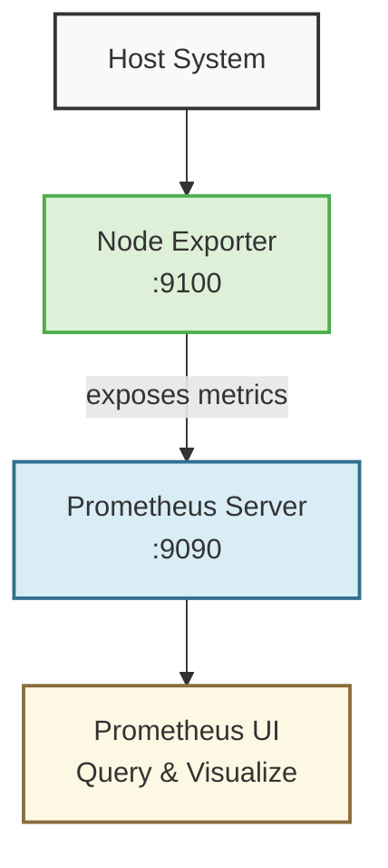

# Prometheus Monitoring Setup

A basic monitoring infrastructure using Prometheus and Node Exporter running with Docker Compose.

## Architecture


- **Host System** : The underlying system being monitored
- **Node Exporter** : Collects system metrics (CPU, memory, disk, network)
- **Prometheus Server** : Scrapes and stores metrics from Node Exporter
- **Prometheus UI** : Web interface for querying and visualizing the collected metrics


The components work together:
- Node Exporter exposes metrics on port 9100
- Prometheus scrapes these metrics every 15s
- Metrics can be queried and visualized in Prometheus UI

## Project Files

- **prometheus.yml**: Configuration defining what metrics to collect
- **docker-compose.yml**: Container setup for both components

## Getting Started

```bash
# Start the services
docker compose up -d

# Access Prometheus UI
# http://localhost:9090

# View Node Exporter metrics
# http://localhost:9100/metrics
```

## Useful Queries

- **up** - Check if targets are working
- **node_cpu_seconds_total** - CPU usage
- **node_memory_MemFree_bytes** - Free memory
- **node_disk_io_time_seconds_total** - Disk I/O
